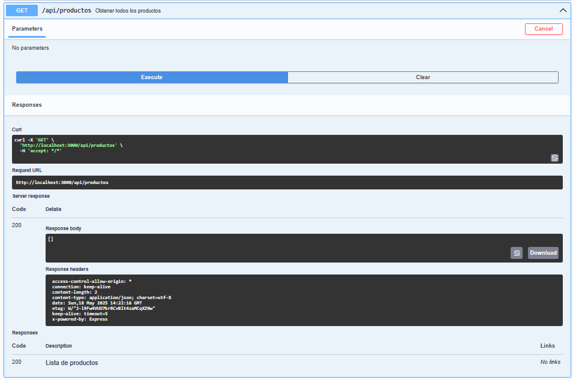
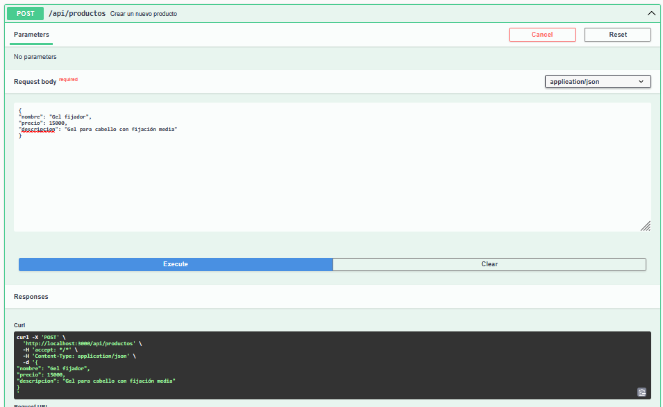
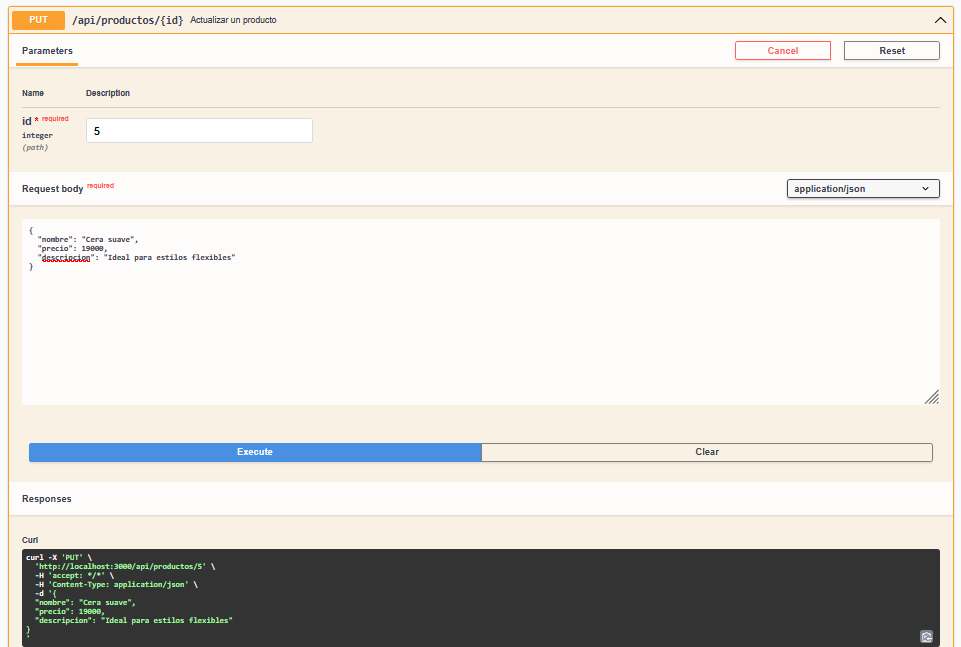
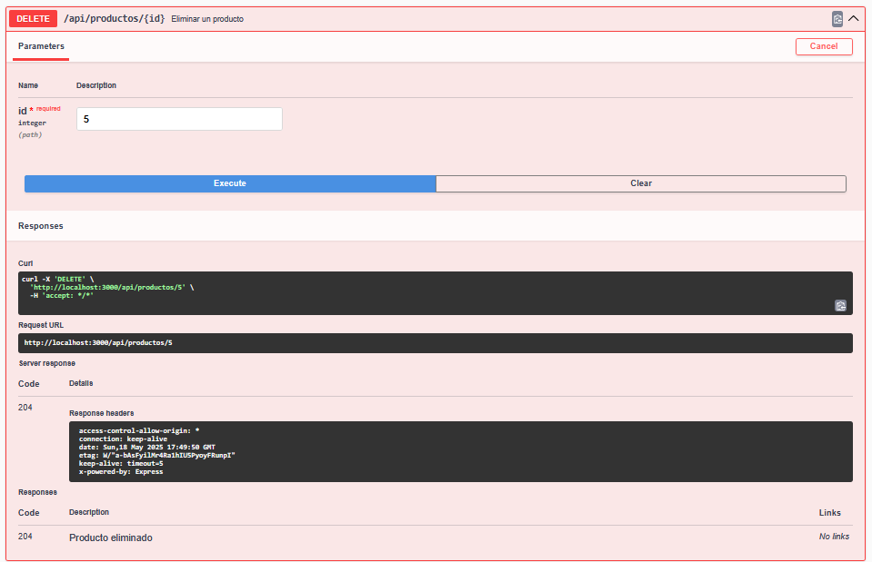

# 📋 Historias de Usuario y Evidencia de Pruebas

Este archivo documenta las funcionalidades implementadas en la API para la gestión de productos de una barbería, junto con evidencia de pruebas realizadas desde Swagger.

---

## ✅ HU1 - Ver lista de productos

- 📤 Endpoint: `GET /api/productos`
- 📥 Resultado: `200 OK`
- 📸 

---

## ✅ HU2 - Registrar nuevo producto

- 📤 Endpoint: `POST /api/productos`
- 📥 Resultado: `201 Created`
- 📸 

---

## ✅ HU3 - Editar producto existente

- 📤 Endpoint: `PUT /api/productos/{id}`
- 📥 Resultado: `200 OK`
- 📸 

---

## ✅ HU4 - Eliminar producto

- 📤 Endpoint: `DELETE /api/productos/{id}`
- 📥 Resultado: `204 No Content`
- 📸 

---

## ✅ HU5 - Documentación de la API

- 📤 Acceso: `GET http://localhost:3000/api-docs`
- 📸 
